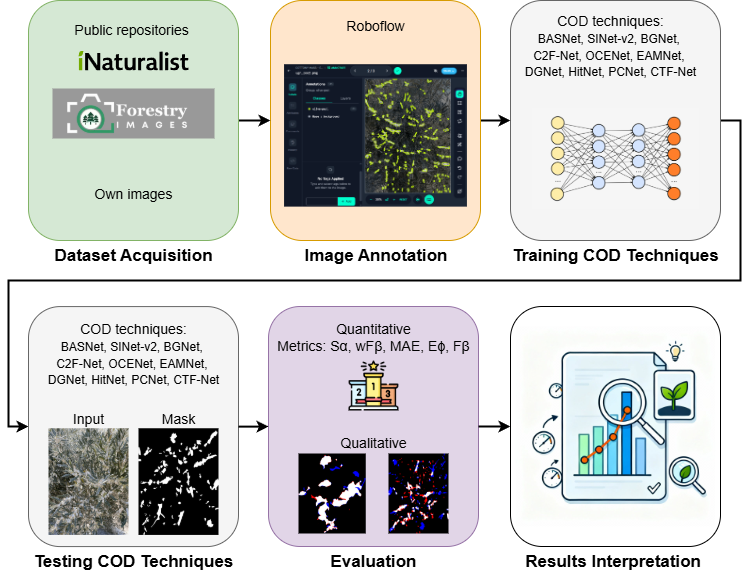

# Image Segmentation of cottony mass produced by Euphyllura olivina (Hemiptera: Psyllidae) in olive trees using Deep Learning

The olive psyllid (Euphyllura olivina), previously considered a secondary pest in Spain, is becoming more prevalent due to climate change and rising average temperatures. Its cottony wax secretions can cause substantial damage to olive crops under certain climatic conditions. Traditional monitoring methods for this pest are often labor-intensive, subjective, and impractical for large-scale surveillance. In this study, we present an automatic image segmentation approach based on deep learning to detect and quantify the cottony masses produced by E. olivina in olive trees. We developed and publicly released a well-annotated image dataset and conducted a comprehensive evaluation of current camouflaged object detection (COD) methods for this task. Our results show that deep learning-based segmentation enables accurate and non-invasive assessment of pest symptoms, even in challenging visual conditions. However, further calibration and field validation are required before these methods can be deployed for operational integrated pest management. This work establishes a public dataset and a baseline benchmark, providing a foundation for future research and decision-support tools in precision agriculture. The dataset is publicly available at Roboflow: https://app.roboflow.com/test-bx6i4/cottony-mass-euphyllura-olivina-5ue4p/

# Pipeline
Overall pipeline of the proposed methodology.

 <br>


# Citation
Please cite those paper if you find helpful,
```
@Article{agriculture15232485,
AUTHOR = {Velesaca, Henry O. and Ruano, Francisca and Gomez-Cantos, Alice and Holgado-Terriza, Juan A.},
TITLE = {Image Segmentation of Cottony Mass Produced by Euphyllura olivina (Hemiptera: Psyllidae) in Olive Trees Using Deep Learning},
JOURNAL = {Agriculture},
VOLUME = {15},
YEAR = {2025},
NUMBER = {23},
ARTICLE-NUMBER = {2485},
URL = {https://www.mdpi.com/2077-0472/15/23/2485},
ISSN = {2077-0472},
ABSTRACT = {The olive psyllid (Euphyllura olivina), previously considered a secondary pest in Spain, is becoming more prevalent due to climate change and rising average temperatures. Its cottony wax secretions can cause substantial damage to olive crops under certain climatic conditions. Traditional monitoring methods for this pest are often labor-intensive, subjective, and impractical for large-scale surveillance. This study presents an automatic image segmentation approach based on deep learning to detect and quantify the cottony masses produced by E. olivina in olive trees. A well-annotated image dataset is developed and published, and a thorough evaluation of current camouflaged object detection (COD) methods is carried out for this task. Our results show that deep learning-based segmentation enables accurate and non-invasive assessment of pest symptoms, even in challenging visual conditions. However, further calibration and field validation are required before these methods can be deployed for operational integrated pest management. This work establishes a public dataset and a baseline benchmark, providing a foundation for future research and decision-support tools in precision agriculture.},
DOI = {10.3390/agriculture15232485}
}
```
